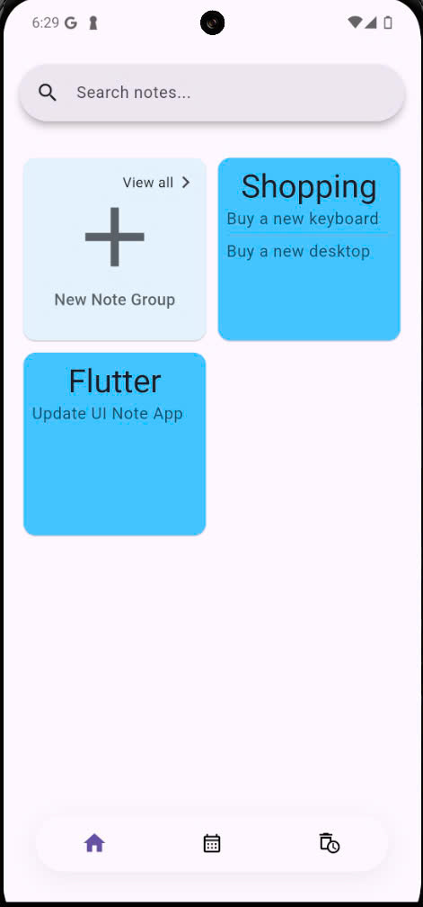
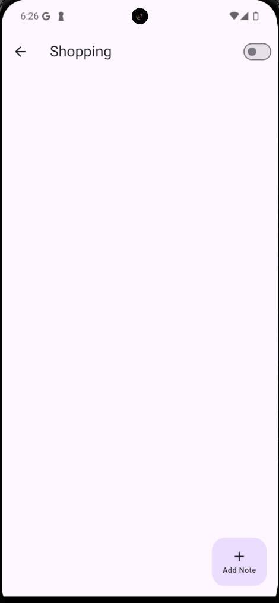
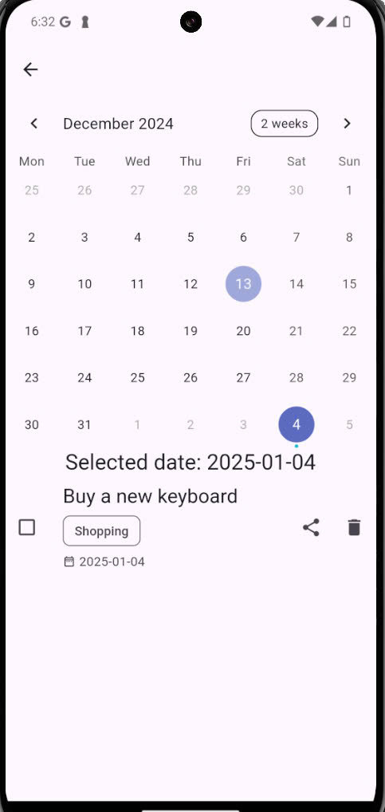
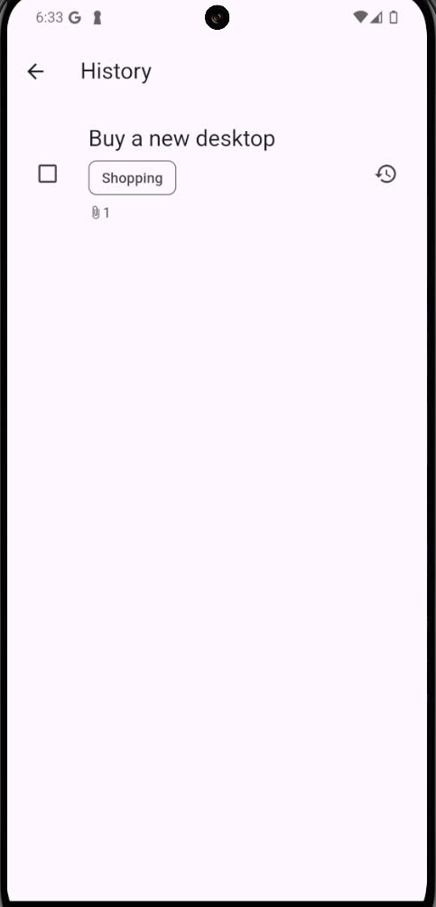
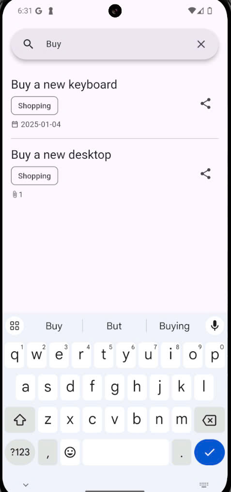

# note_app

A new Flutter project - Note App.

Xin chào, tôi là Nguyễn Văn Lâm, một người mới bắt đầu học lập trình. Đây là dự án Flutter đầu tiên của tôi, được xây dựng sau khi tham gia khóa học Flutter tại Techmaster.

 Note App là một ứng dụng ghi chú giúp người dùng quản lý các kế hoạch, công việc đã hoàn thành hoặc cần làm trong tương lai.
 Ứng dụng cho phép người dùng dễ dàng tạo, sửa đổi và xóa ghi chú, cũng như theo dõi tiến độ công việc...

Tính năng
+ Tạo, sửa, xóa ghi chú: Người dùng có thêm, chỉnh sửa hoặc xóa ghi chú.
+ Đính kèm các file thông tin bổ sung cho ghi chú(ảnh, video...).
+ Đánh dấu ngày tháng: Ghi chú có thể được gán ngày tháng để theo dõi.
+ Đánh dấu ghi chú đã thực hiện: Người dùng có thể đánh dấu ghi chú đã hoàn thành.
+ Chia sẻ ghi chú: Ghi chú có thể được chia sẻ với các nền tảng bên ngoài khác...

 - Kiến trúc dự án
 Dự án được triển khai với các thành phần sau:
+ Observable: Lắng nghe sự thay đổi của dữ liệu.
+ Data Layer: Chứa các collection đại diện cho thông tin lưu trữ trong cơ sở dữ liệu (ISAR).
+ Entity Layer: Chứa các model được sử dụng để hiển thị dữ liệu và thực hiện logic.
+ Repository Layer: Quản lý việc đọc và ghi dữ liệu từ cơ sở dữ liệu...

 - Công nghệ sử dụng
 + Dart
 + Flutter
 + Bloc
 + Isar
 + Share_plus
 + Build runner...

  Dự án sử dụng BLOC để quản lý trạng thái màn hình và logic của ứng dụng.
  Flutter 3.22.0, Dart 3.4.0

# App Screenshots
|  |  |
|---------------------------------------------------------------|-------------------------------------------------------------------|
| Home screen                                                  | Add new note group screen                                         |

|  |  |
|----------------------------------------------------------------------|--------------------------------------------------------------------|
| Calendar screen                                                     | Delete and undo screen                                             |

|  | |
|-----------------------------------------------------------------|-------------------------------------------------------------------|
| Search screen                                                  |                                                                   |

- Slide: https://docs.google.com/presentation/d/1UQH2oePm9aSSybGuD__vZqEZ8UZdSwFp/edit#slide=id.p1

- [Lab: Write your first Flutter app](https://docs.flutter.dev/get-started/codelab)
- [Cookbook: Useful Flutter samples](https://docs.flutter.dev/cookbook)

For help getting started with Flutter development, view the
[online documentation](https://docs.flutter.dev/), which offers tutorials,
samples, guidance on mobile development, and a full API reference.
